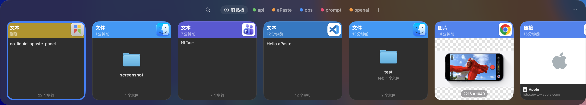
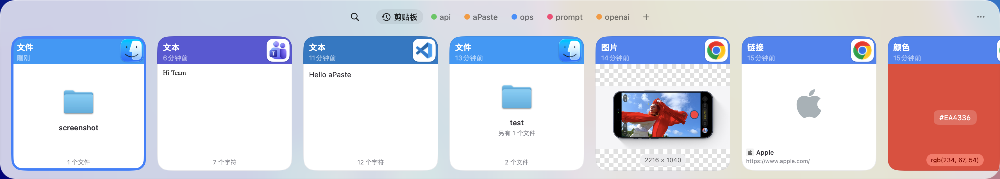

# aPaste

### Your clipboard history, one shortcut away.

[](https://github.com/AlliotTech/aPaste/releases/latest)
[](https://github.com/AlliotTech/aPaste/releases/latest)
[](LICENSE)

aPaste is a fast, keyboard-first clipboard manager for macOS. Open a beautiful panel, search everything you copied, keep important snippets on pinboards, and paste back into your workflow without breaking focus.

[Download Latest Release](https://github.com/AlliotTech/aPaste/releases/latest) · [Install with Homebrew](#homebrew)

`Instant recall` · `Pinboards for snippets` · `Private by default` · `Menu bar only` · `Built for macOS`

```bash
brew tap alliottech/tap
brew install --cask alliottech/tap/apaste --no-quarantine
```

| Dark | Light |
|:---:|:---:|
|  |  |

One shortcut opens your full clipboard timeline with rich previews, fast search, and pinned boards that stay available whenever you need them.

## Why aPaste

- **Recall anything instantly** — Browse your clipboard history in a focused panel built for fast scanning and quick paste-back
- **Keep what matters** — Save recurring snippets, links, and assets to pinboards instead of losing them in a long history
- **Stay in flow** — Navigate, search, and paste without touching the mouse
- **Present safely** — Ignore sensitive apps and hide preview contents when you need privacy
- **Feel native on macOS** — Menu bar app, no Dock icon, no clutter, no friction

## Features

- **Never lose a copy** — Full clipboard history, captured automatically from every app                      
- **Pinboards** — Save snippets to color-coded boards, always one shortcut away, never auto-deleted
- **Instant search** — Fuzzy search across your entire history as you type
- **Privacy controls** — Ignore specific apps, hide contents from screenshots                                
- **Zero footprint** — No Dock icon. No splash screen. Starts at login. Runs silently

## Screenshots

### Panel




### Liquid Glass


### Standard


## Keyboard Shortcuts

All shortcuts are customizable in Settings → Shortcuts.

| Action | Default |
|:---|:---|
| Toggle panel | `^ `` ` |
| Activate aPaste Stack | `⌘ ⇧ C` |
| Next Pinboard | `⌘ →` |
| Previous Pinboard | `⌘ ←` |
| Create Pinboard | `⌘ ⇧ N` |
| Paste selected item | `↩` |
| Search history | Type anything |
| Navigate items | `← ↑ ↓ →` |
| Close panel | `Esc` |

## Install

### Homebrew

```bash
brew tap alliottech/tap
brew install --cask alliottech/tap/apaste --no-quarantine
```

### Manual

Download the [latest DMG](https://github.com/AlliotTech/aPaste/releases/latest), drag `aPaste.app` to `/Applications`, then remove the quarantine flag:

```bash
xattr -d com.apple.quarantine /Applications/aPaste.app
```

## Requirements

macOS 15 or later.

