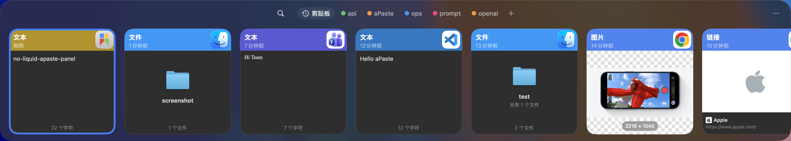
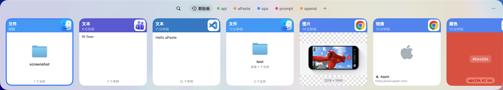

# aPaste

[English](README.md) | 简体中文

### 一个快捷键，随时找回剪贴板历史。

[](https://github.com/AlliotTech/aPaste/releases/latest)
[](https://github.com/AlliotTech/aPaste/releases/latest)

aPaste 是一款快速、键盘优先的 macOS 剪贴板管理器。打开简洁专注的面板，即可搜索已保存的剪贴板历史，将重要内容收进 Pinboard，并在不中断当前工作的情况下快速粘贴。

[下载最新版本](https://github.com/AlliotTech/aPaste/releases/latest) · [通过 Homebrew 安装](#homebrew)

`快速找回` · `Pinboard 收藏` · `默认保护隐私` · `菜单栏应用` · `专为 macOS 打造`

```bash
brew tap alliottech/tap
brew install --cask alliottech/tap/apaste
xattr -dr com.apple.quarantine /Applications/aPaste.app
```

| 深色模式 | 浅色模式 |
|:---:|:---:|
|  |  |

一个快捷键即可打开已保存的剪贴板历史，通过丰富预览和快速搜索找到所需内容，并随时访问 Pinboard 中的常用项目。

## 为什么选择 aPaste

- **快速找到已保存的内容** — 在专注的面板中浏览剪贴板历史，快速扫描、筛选和粘贴
- **收藏重要内容** — 将常用片段、链接和资源保存到 Pinboard，不必再到冗长的历史记录中翻找
- **保持工作节奏** — 无需触碰鼠标，即可完成导航、搜索和粘贴
- **演示时保护隐私** — 忽略敏感应用，并在需要时隐藏预览内容
- **按自己的方式同步** — 通过自己控制的文件夹选择性同步，并支持端到端加密
- **原生 macOS 体验** — 常驻菜单栏，无 Dock 图标，不带来多余干扰

## 功能

- **自动保存剪贴板历史** — 捕获受支持的剪贴板内容，同时遵循忽略应用以及机密或临时内容标记
- **Pinboard** — 将常用片段保存到不同颜色的面板中，一个快捷键即可访问，并且不会被自动清理
- **丰富预览** — 将富文本、链接、颜色、图片和文件显示为易于浏览的卡片
- **即时搜索** — 输入时实时搜索，并可按类型、日期或来源应用进一步筛选
- **隐私控制** — 忽略指定应用、跳过临时或机密剪贴板内容，并在截图中隐藏内容
- **智能捕获规则** — 按内容类型、来源应用、文本、URL 域名、文件扩展名或捕获字节范围忽略或自动收藏新内容
- **快捷操作** — 转换文本、格式化 JSON、清理链接、创建 Markdown 链接，或复制图片识别出的文字
- **文件夹同步** — 通过 Syncthing、Dropbox、iCloud Drive 或其他共享文件夹同步历史记录和 Pinboard
- **安静常驻** — 无 Dock 图标、无启动画面，并可选择是否开机启动

## 截图

### 面板




### Liquid Glass（液态玻璃）


### 标准效果


## 键盘快捷键

大多数命令快捷键都可以在“设置 → 快捷键”中自定义；下表同时列出了固定的面板导航快捷键，方便查阅。

| 操作 | 默认快捷键 |
|:---|:---|
| 显示或隐藏面板 | `⌃ + 反引号` |
| 激活 aPaste Stack | `⌘ ⇧ C` |
| 下一个 Pinboard | `⌘ →` |
| 上一个 Pinboard | `⌘ ←` |
| 新建 Pinboard | `⌘ ⇧ N` |
| 切换搜索 | `⌘ F` |
| 跳转到来源上下文 | `⌘ G` |
| 复制并关闭 | `⌘ C` |
| 选择所有卡片 | `⌘ A` |
| 撤销删除 | `⌘ Z` |
| 打开设置 | `⌘ ,` |
| 粘贴选中项目 | `↩` |
| 搜索历史记录 | 直接输入 |
| 浏览项目 | `← ↑ ↓ →` |
| 关闭面板 | `Esc` |

## 安装

### Homebrew

```bash
brew tap alliottech/tap
brew install --cask alliottech/tap/apaste
xattr -dr com.apple.quarantine /Applications/aPaste.app
```

### 手动安装

从 [Releases](https://github.com/AlliotTech/aPaste/releases/latest) 下载与 Mac 架构匹配的最新 DMG，将 `aPaste.app` 拖入 `/Applications`，然后移除隔离属性：

```bash
xattr -dr com.apple.quarantine /Applications/aPaste.app
```

## 系统要求

macOS 15 或更高版本。
